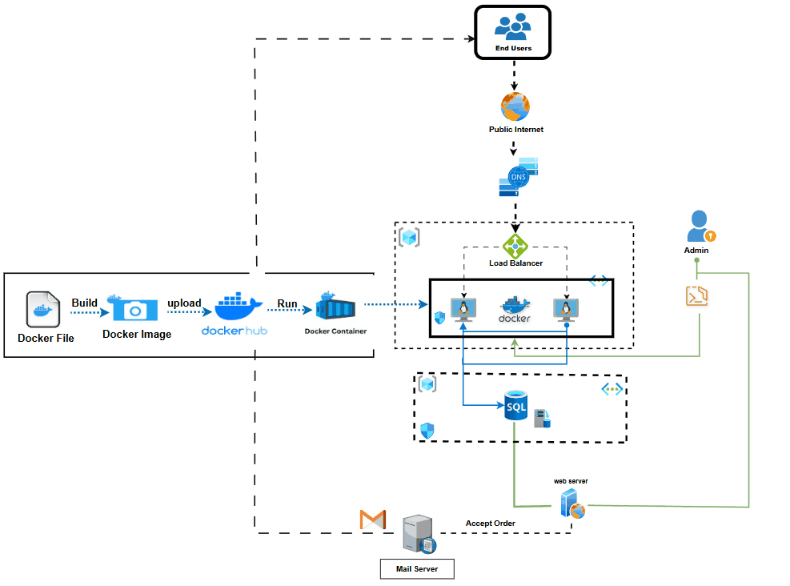

# ☁️ Cloud-Native E-Commerce Platform
### Cloud + Docker + Linux + AI Integration Project



[](https://www.docker.com/)
[](https://azure.microsoft.com/)
[](https://flask.palletsprojects.com/)
[](https://www.linux.org/)

---

## 🎯 Overview

This project is a **cloud-native mini e-commerce platform** that demonstrates the integration of modern DevOps practices, cloud infrastructure, and AI-assisted development. Built to simulate a real-world production environment, it showcases:

- **Cloud Infrastructure**: Deployed on Azure with load balancing across multiple VMs
- **Containerization**: Fully dockerized application for consistent deployments
- **Database**: Cloud-hosted SQL database for persistent data storage
- **Email Integration**: Automated order confirmations via Gmail API
- **AI-Generated UI**: Frontend developed with Claude.ai assistance

---

## ✨ Features

### Customer Features
- 🔐 **User Authentication**: Secure signup and login system
- 🛍️ **Product Browsing**: View available products and details
- 🛒 **Order Placement**: Add items to cart and place orders
- 📧 **Email Notifications**: Automatic order confirmation/rejection emails
- 📱 **Responsive Design**: Mobile-friendly interface

### Admin Features
- 📊 **Order Management Dashboard**: View all pending orders at `/admin/all-orders`
- ✅ **Order Approval**: Confirm orders with one click
- ❌ **Order Rejection**: Reject orders with automated customer notification
- 📈 **Real-time Updates**: Instant order status changes

### Infrastructure Features
- ⚖️ **Load Balancing**: Traffic distributed across multiple VM instances
- 🔄 **High Availability**: Redundant servers for continuous uptime
- 🐳 **Container Orchestration**: Easy scaling with Docker
- ☁️ **Cloud-Native**: Built for cloud infrastructure from the ground up

---

## 🛠️ Tech Stack

| Category | Technology | Purpose |
|----------|-----------|---------|
| **Cloud Provider** | Microsoft Azure | Linux VMs, Load Balancer, DNS, Cloud SQL |
| **Backend Framework** | Flask (Python) | RESTful API and business logic |
| **Frontend** | HTML5, CSS3, JavaScript | User interface (AI-generated with Claude.ai) |
| **Database** | Azure SQL Database | Persistent data storage |
| **Containerization** | Docker | Application containerization and deployment |
| **Container Registry** | Docker Hub | Image storage and distribution |
| **Operating System** | Ubuntu Linux | VM operating system |
| **Email Service** | Gmail API | Order notification emails |
| **Version Control** | Git/GitHub | Source code management |

---

## 🏗️ Architecture

```
                          ┌─────────────────┐
                          │   Azure DNS     │
                          └────────┬────────┘
                                   │
                          ┌────────▼────────┐
                          │  Load Balancer  │
                          └────────┬────────┘
                                   │
                    ┌──────────────┴──────────────┐
                    │                             │
            ┌───────▼────────┐          ┌────────▼───────┐
            │   VM Server 1  │          │  VM Server 2   │
            │  (Docker)      │          │  (Docker)      │
            └───────┬────────┘          └────────┬───────┘
                    │                             │
                    └──────────────┬──────────────┘
                                   │
                          ┌────────▼────────┐
                          │  Azure SQL DB   │
                          └─────────────────┘
                                   │
                          ┌────────▼────────┐
                          │   Gmail API     │
                          └─────────────────┘
```

### Workflow
1. **User Request** → Azure DNS resolves domain to Load Balancer
2. **Load Balancer** → Distributes traffic to available VM instances
3. **Flask Application** → Processes requests and interacts with database
4. **Database Operations** → CRUD operations on Azure SQL Database
5. **Email Notifications** → Gmail API sends order confirmations/rejections

---

## 📦 Prerequisites

Before you begin, ensure you have the following installed:

- **Docker** (v20.10+)
- **Python** (v3.8+)
- **Git**
- **Azure CLI** (for cloud deployment)
- **Gmail Account** (for email notifications)

---


## 💻 Usage

### Accessing the Application
- **Homepage**: `http://localhost:5000`
- **Login**: `http://localhost:5000/login`
- **Signup**: `http://localhost:5000/signup`
- **Products**: `http://localhost:5000/products`
- **Admin Dashboard**: `http://localhost:5000/admin/all-orders`

### Customer Workflow
1. Create an account via `/signup`
2. Login with credentials
3. Browse products at `/products`
4. Place an order
5. Receive email confirmation or rejection

### Admin Workflow
1. Access admin dashboard at `/admin/all-orders`
2. Review pending orders
3. Click **Confirm** to approve (sends confirmation email)
4. Click **Reject** to decline (sends rejection email)

---

## 📁 Project Structure

```
project_cloud_docker_linux/
│
├── app.py                          # Main Flask application
├── Dockerfile                      # Docker configuration
├── requirements.txt                # Python dependencies
├── README.md                       # Project documentation
├── project_arch.gif                # Architecture diagram
│
├── static/                         # Static assets
│   ├── css/
│       └── style.css              # Application styles
│  
│
├── templates/                      # HTML templates
    ├── login.html                 # Login page
    ├── signup.html                # Registration page
    ├── product.html               # Product listing
    ├── orders_list.html           # Admin order management
    └── pto.html                   # Additional template
```

---

## 🔌 API Endpoints

| Method | Endpoint | Description | Auth Required |
|--------|----------|-------------|---------------|
| `GET` | `/` | Homepage | No |
| `GET` | `/signup` | Registration page | No |
| `POST` | `/signup` | Create new account | No |
| `GET` | `/login` | Login page | No |
| `POST` | `/login` | Authenticate user | No |
| `GET` | `/products` | View products | Yes |
| `POST` | `/order` | Place new order | Yes |
| `GET` | `/admin/all-orders` | Admin dashboard | Admin |
| `POST` | `/admin/confirm/<id>` | Confirm order | Admin |
| `POST` | `/admin/reject/<id>` | Reject order | Admin |
| `GET` | `/logout` | User logout | Yes |


---

### Email Notification Testing
1. Place a test order as a customer
2. Navigate to `/admin/all-orders`
3. Confirm or reject the order
4. Verify email received at customer's email address

---

## 🤝 Contributing

Contributions are welcome! Please follow these steps:

1. Fork the repository
2. Create a feature branch (`git checkout -b feature/AmazingFeature`)
3. Commit your changes (`git commit -m 'Add some AmazingFeature'`)
4. Push to the branch (`git push origin feature/AmazingFeature`)
5. Open a Pull Request

---

## 📄 License

This project is licensed under the MIT License - see the [LICENSE](LICENSE) file for details.

---

## 👤 Author

**Mohamed Sarhan Elhussieny**

- GitHub: [@Mohamed-Sarhan-Elhussieny](https://github.com/Mohamed-Sarhan-Elhussieny)

---

## 🙏 Acknowledgments

- **Claude.ai** for AI-assisted frontend development
- **Azure** for cloud infrastructure
- **Docker** for containerization platform
- **Flask** community for excellent documentation


<div align="center">
  Made with ❤️ using Cloud + Docker + Linux + AI
</div>
